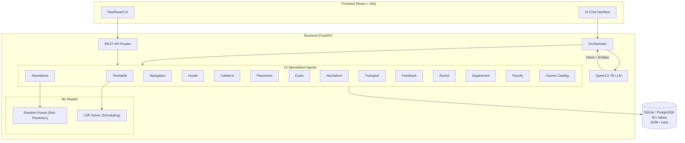

# Smart Campus — Autonomous Multi-Agent AI System

## What Is This Project?

This is a **full-stack university campus management platform** powered by **14 specialized AI agents** coordinated by a central orchestrator. A student logs in and can interact with any campus service — timetable, attendance, hostel, cafeteria, placements, exams, and more — all through a unified dashboard and an AI chatbot assistant.

---

## Technology Stack

| Layer | Technology | Purpose |
|---|---|---|
| **Backend Framework** | FastAPI (Python 3.11+) | REST API server with auto-generated Swagger docs |
| **ORM** | SQLAlchemy | Database models & queries |
| **Database** | SQLite (default) / PostgreSQL | Stores 550,000+ rows of synthetic data |
| **Agentic AI** | LangGraph + LangChain | Multi-agent orchestration workflow |
| **Local LLM** | Qwen2.5-7B (GGUF via llama-cpp) | Intent classification & natural language responses |
| **Machine Learning** | Scikit-Learn (Random Forest) | Attendance debarment risk prediction |
| **Validation** | Pydantic | Request/response schema validation |
| **Auth** | python-jose + passlib | JWT-based authentication |
| **Logging** | Loguru | Structured logging |
| **Data Generation** | Faker | 550K+ synthetic seed records |
| **Frontend Framework** | React 19 (Vite) | Single-page application |
| **Styling** | TailwindCSS v4 + Custom CSS | Glassmorphic dark-mode design system |
| **State Management** | Zustand | Client-side state |
| **Data Fetching** | TanStack React Query | Server state & caching |
| **Charts** | Recharts | Data visualization |
| **Maps** | Leaflet + React-Leaflet | Campus navigation maps |
| **Animations** | Framer Motion | Micro-animations & transitions |
| **UI Primitives** | Radix UI | Accessible dialog, dropdown, toast, avatar, label |
| **Forms** | React Hook Form + Zod | Form handling & validation |
| **Routing** | React Router v7 | Client-side navigation |
| **Deployment** | Docker + Docker Compose | Containerized full-stack deployment |

---

## The 14 AI Agents

Each agent is a specialized module in [agents/](file:///c:/Users/Giridharan/Downloads/agentverse-2/backend/app/agents) that handles a specific campus domain:

| # | Agent | File | What It Does |
|---|---|---|---|
| 1 | **Timetable Agent** | [timetable_agent.py](file:///c:/Users/Giridharan/Downloads/agentverse-2/backend/app/agents/timetable_agent.py) | Fetches student schedules by day/semester |
| 2 | **Timetable Solver** | [timetable_solver.py](file:///c:/Users/Giridharan/Downloads/agentverse-2/backend/app/agents/timetable_solver.py) | **CSP/Backtracking solver** — detects conflicts (classroom, faculty, section double-booking) and finds conflict-free slots |
| 3 | **Attendance Agent** | [attendance_agent.py](file:///c:/Users/Giridharan/Downloads/agentverse-2/backend/app/agents/attendance_agent.py) | Course-wise attendance metrics with **ML-powered debarment risk alerts** |
| 4 | **Navigation Agent** | [navigation_agent.py](file:///c:/Users/Giridharan/Downloads/agentverse-2/backend/app/agents/navigation_agent.py) | Campus building locations, routes, walking times, wheelchair accessibility |
| 5 | **Hostel Agent** | [hostel_agent.py](file:///c:/Users/Giridharan/Downloads/agentverse-2/backend/app/agents/hostel_agent.py) | Room allocations, complaints, mess menu, warden info |
| 6 | **Cafeteria Agent** | [cafeteria_agent.py](file:///c:/Users/Giridharan/Downloads/agentverse-2/backend/app/agents/cafeteria_agent.py) | Today's menu + **content-based food recommendations** from order history |
| 7 | **Placement Agent** | [placement_agent.py](file:///c:/Users/Giridharan/Downloads/agentverse-2/backend/app/agents/placement_agent.py) | Placement readiness scores, skill matching, **company recommendations** based on student profile |
| 8 | **Exam Agent** | [exam_agent.py](file:///c:/Users/Giridharan/Downloads/agentverse-2/backend/app/agents/exam_agent.py) | Exam schedules, hall tickets, results, grade reports |
| 9 | **Hackathon Agent** | [hackathon_agent.py](file:///c:/Users/Giridharan/Downloads/agentverse-2/backend/app/agents/hackathon_agent.py) | **Skill-based hackathon recommendations** matching student expertise |
| 10 | **Transport Agent** | [transport_agent.py](file:///c:/Users/Giridharan/Downloads/agentverse-2/backend/app/agents/transport_agent.py) | Bus routes, schedules, stops, delay history |
| 11 | **Feedback Agent** | [feedback_agent.py](file:///c:/Users/Giridharan/Downloads/agentverse-2/backend/app/agents/feedback_agent.py) | Feedback forms, **sentiment analysis**, platform-wide summaries |
| 12 | **Alumni Agent** | [alumni_agent.py](file:///c:/Users/Giridharan/Downloads/agentverse-2/backend/app/agents/alumni_agent.py) | **Mentor matching** — connects students with alumni based on skills & department |
| 13 | **Department Agent** | [department_agent.py](file:///c:/Users/Giridharan/Downloads/agentverse-2/backend/app/agents/department_agent.py) | Department info, HOD, courses, faculty listing |
| 14 | **Faculty Agent** | [faculty_agent.py](file:///c:/Users/Giridharan/Downloads/agentverse-2/backend/app/agents/faculty_agent.py) | Faculty profiles, office hours, research areas, contact info |

### The Orchestrator — [orchestrator.py](file:///c:/Users/Giridharan/Downloads/agentverse-2/backend/app/agents/orchestrator.py)

The central brain that:
1. **Maintains conversation memory** (session context: last agent, entity, department, faculty, course)
2. **Classifies user intent** using the local Qwen2.5-7B LLM → routes to the correct agent
3. **Calls the specialized agent** to fetch structured data from the database
4. **Generates a natural language response** from the data (zero-hallucination: LLM can only use retrieved data)

---

## Database Models — 30+ Tables

Defined in [models.py](file:///c:/Users/Giridharan/Downloads/agentverse-2/backend/app/models/models.py) (727 lines):

| Domain | Tables |
|---|---|
| **Core** | `students`, `faculty`, `departments`, `classrooms`, `courses` |
| **Timetable** | `timetable_slots` (with unique constraint for conflict prevention) |
| **Attendance** | `attendance_records` |
| **Conversation** | `conversation_sessions` (agent memory) |
| **Navigation** | `buildings`, `campus_routes` |
| **Hostel** | `hostels`, `hostel_rooms`, `hostel_allocations`, `hostel_complaints`, `mess_menu` |
| **Cafeteria** | `food_items`, `cafeteria_menu`, `food_orders`, `food_ratings` |
| **Placement** | `skills`, `student_skills`, `companies`, `company_skill_requirements`, `placement_profiles`, `interview_questions` |
| **Exams** | `exam_schedules`, `hall_tickets`, `exam_results` |
| **Hackathons** | `hackathons`, `hackathon_registrations` |
| **Transport** | `buses`, `bus_stops`, `bus_schedules`, `bus_delays` |
| **Feedback** | `feedback_forms`, `feedback_responses` (with sentiment scoring) |
| **Alumni** | `alumni`, `alumni_skills`, `mentorship_requests` |
| **General** | `university`, `labs`, `books`, `events`, `faqs` |

### Synthetic Data Scale
The seeder ([seed_all.py](file:///c:/Users/Giridharan/Downloads/agentverse-2/backend/scripts/seed_all.py)) generates **550,000+ rows**: 150 faculty, 250 classrooms, 300 courses, 2,500 students, 50,000 timetable slots, 500,000 attendance logs.

---

## Machine Learning Components

### 1. Attendance Risk Prediction — [attendance_model.py](file:///c:/Users/Giridharan/Downloads/agentverse-2/backend/app/ml/attendance_model.py)
- **Algorithm**: Random Forest Classifier (100 estimators, max depth 6)
- **Features**: CGPA, semester, department (one-hot encoded), early attendance rate (first 10 classes)
- **Target**: Predicts if a student's final attendance will drop below 75% (debarment threshold)
- **Fallback**: Heuristic rule-based prediction if model isn't trained yet

### 2. Timetable CSP Solver — [timetable_solver.py](file:///c:/Users/Giridharan/Downloads/agentverse-2/backend/app/agents/timetable_solver.py)
- **Algorithm**: Backtracking CSP with randomized variable ordering (genetic-style selection)
- **Constraints**: No classroom double-booking, no faculty double-booking, no section double-booking
- **Conflict Detection**: Scans all slots and reports every violation

---

## Frontend — React Dashboard

All in a single [App.jsx](file:///c:/Users/Giridharan/Downloads/agentverse-2/frontend/src/App.jsx) (1,246 lines) with additional page components in [pages/](file:///c:/Users/Giridharan/Downloads/agentverse-2/frontend/src/pages):

| Page | Description |
|---|---|
| **Login** | Student ID + password login with quick-access demo accounts |
| **Overview** | Dashboard with stats cards, upcoming classes, attendance summary |
| **Timetable** | Weekly schedule grid view |
| **Attendance** | Course-wise attendance with risk alerts & charts |
| **Navigation** | Campus map with building locations (Leaflet) |
| **Hostel** | Room info, mess menu, complaints |
| **Cafeteria** | Menu browser with food recommendations |
| **Placement** | Readiness scores, company matches, skill gaps |
| **Exams** | Exam schedule, hall tickets, results |
| **Hackathons** | Recommended hackathons based on skills |
| **Transport** | Bus routes, schedules, delay info |
| **Feedback** | Submit & view feedback with sentiment |
| **Alumni** | Mentor connections & mentorship requests |
| **AI Assistant** | Chat interface powered by the orchestrator |

---

## API Endpoints

All routes are prefixed with `/api/v1` and registered in [main.py](file:///c:/Users/Giridharan/Downloads/agentverse-2/backend/app/main.py):

| Route Prefix | Router File |
|---|---|
| `/auth/login` | Inline in main.py |
| `/timetable/*` | [timetable.py](file:///c:/Users/Giridharan/Downloads/agentverse-2/backend/app/api/timetable.py) |
| `/attendance/*` | [attendance.py](file:///c:/Users/Giridharan/Downloads/agentverse-2/backend/app/api/attendance.py) |
| `/navigation/*` | [navigation.py](file:///c:/Users/Giridharan/Downloads/agentverse-2/backend/app/api/navigation.py) |
| `/hostel/*` | [hostel.py](file:///c:/Users/Giridharan/Downloads/agentverse-2/backend/app/api/hostel.py) |
| `/cafeteria/*` | [cafeteria.py](file:///c:/Users/Giridharan/Downloads/agentverse-2/backend/app/api/cafeteria.py) |
| `/placement/*` | [placement.py](file:///c:/Users/Giridharan/Downloads/agentverse-2/backend/app/api/placement.py) |
| `/exam/*` | [exam.py](file:///c:/Users/Giridharan/Downloads/agentverse-2/backend/app/api/exam.py) |
| `/hackathon/*` | [hackathon.py](file:///c:/Users/Giridharan/Downloads/agentverse-2/backend/app/api/hackathon.py) |
| `/transport/*` | [transport.py](file:///c:/Users/Giridharan/Downloads/agentverse-2/backend/app/api/transport.py) |
| `/feedback/*` | [feedback.py](file:///c:/Users/Giridharan/Downloads/agentverse-2/backend/app/api/feedback.py) |
| `/alumni/*` | [alumni.py](file:///c:/Users/Giridharan/Downloads/agentverse-2/backend/app/api/alumni.py) |
| `/orchestrator/query` | Central AI chat endpoint |

---

## Architecture Diagram



---

## How to Run

```bash
# Backend
cd backend
python -m venv .venv && .\.venv\Scripts\Activate.ps1
pip install -r requirements.txt
python scripts/seed_db.py    # Generates 550K+ rows
python app/main.py           # → http://127.0.0.1:8000

# Frontend
cd frontend
npm install
npm run dev                  # → http://localhost:5173

# Login with: S100001 / test
```
